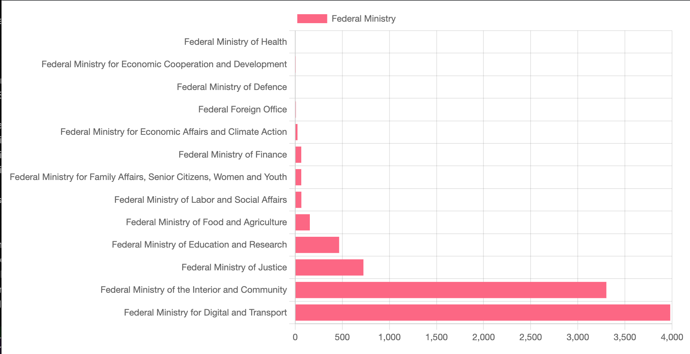

# Prototype - GovData Dashboard

Hello my friend,

this is my take on the coding challenge for Digital Service.
You can find the challenge here:

https://github.com/digitalservice4germany/backend-challenge

## The service in a nutshell

Under the "Open Data Act" federal ministries in Germany should publish their data to GovData.de 
and with this dashboard you can see how well they are doing.

Mine looks like this:

## How to start the service

After you have cloned / downloaded the repository - you can use the Gradle wrapper to start the service:

    ./gradlew bootRun

And I think under Windows you can use

    ./gradlew.bat bootRun

Afterwards you can...

(a) visit the dashboard

http://localhost:8080/

(b) look at the dashboard data as json

http://localhost:8080/dashboard

(c) look at the same data but aggregated to departments

http://localhost:8080/api/v1/federal-ministries

and (d) look at even more (raw) data from GovData by visiting the organizations endpoint 

http://localhost:8080/api/v1/organizations

## Additional metrics

If you are as curious as me,
then maybe you want to have a look at additional metrics. 
For this I introduced actuator and enabled the following endpoints:
- health
- info
- metrics

You can find the endpoints under:

    localhost:8080/actuator